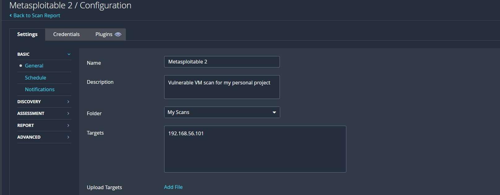
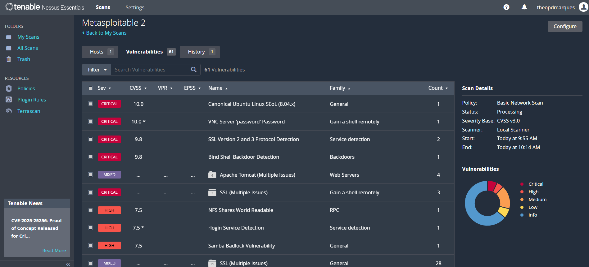
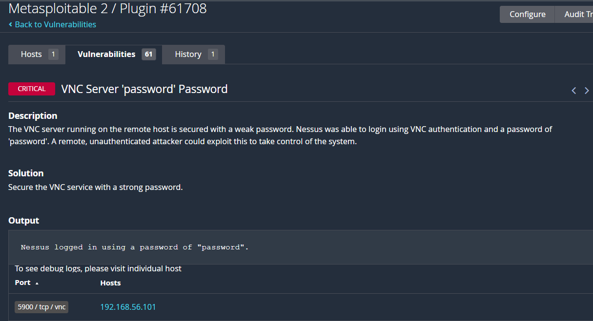
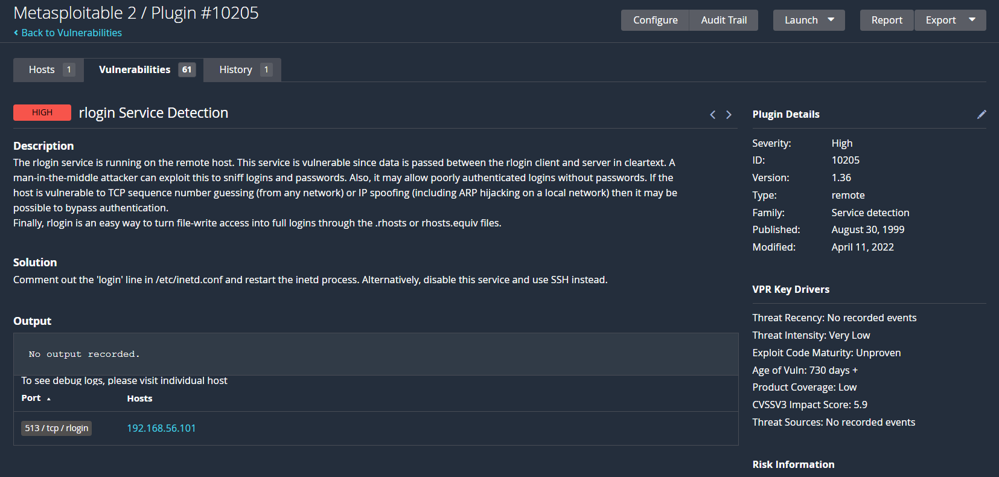
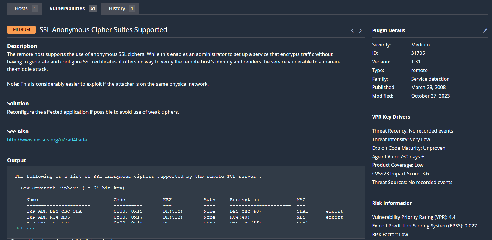

## Project Overview
This project demonstrates the setup and scanning of a vulnerable VM (Metasploitable2) using Nessus. The goal is to identify and analyze vulnerabilities, understand their impact, and suggest remediation strategies.

---

## Lab Setup
- **VM:** Metasploitable 2 (Linux)  
- **Hypervisor:** VirtualBox  
- **VM IP:** 192.168.56.101

---

## Nessus Scan
- **Scan Type:** Basic Network Scan  
- **Target:** Metasploitable2 VM IP 
- **Purpose:** Identify critical, high, medium, and informational vulnerabilities.

---

## Vulnerability Findings

| Vulnerability | Severity | Risk | Remediation |
|---------------|---------|------|------------|
| VNC weak password | Critical | Remote attacker could gain full control using weak VNC password (Possibly dafault password) | Set a strong password for VNC; disable if not needed. Check other systems for use of Dafault Passwords|
| Rlogin service enabled | High | Cleartext login data and poorly authenticated logins; `.rhosts` files could grant full access. | Disable rlogin or comment out 'login' in `/etc/inetd.conf`; use SSH instead. |
| Anonymous SSL ciphers | Medium | Traffic is encrypted but host identity isn’t verified; vulnerable to MITM attacks. | Reconfigure service to use proper SSL/TLS with verified certificates. |

---

## Skills Demonstrated
- Virtual machine setup with VirtualBox  
- Vulnerability scanning with Nessus  
- Interpretation of scan results  
- Understanding of vulnerability severity and remediation strategies  
- Documentation and reporting for cybersecurity projects

---

## Notes
- This is a lab environment; all vulnerabilities are intentionally present for educational purposes.
